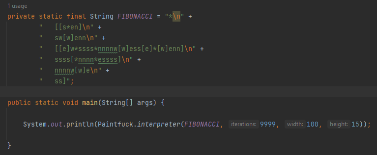
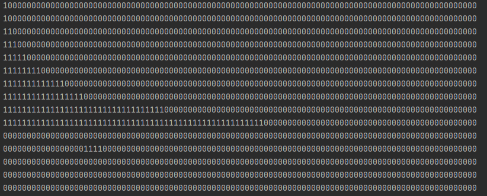

# Simple interpreter for paintfuck

Paintfuck is a borderline-esoteric graphical programming language by User:Whtspc. A derivative from Smallfuck that uses a 2D datagrid instead of 1D.

The commands are:

- n - Move data pointer north (up). s - Move data pointer south (down).
- e - Move data pointer east (right).
- w - Move data pointer west (left).
- \* - Flip current cell. 
- \[ - If cell is 0, jump past matching ].
- ] - Jump to matching \[.
    The spec stipulates that any letter not among these should be ignored.

The output of the program is the 2D grid itself, best as animation while the program is performing, but possibly a picture of the grid after a certain amount of iterations.

In current implementations the data area and therefore the output canvas is limited, with toroidal (i.e. wrapping) behaviour.

Demonstration with fibonacci sequence example:

    *
    [[s*en]
    sw[w]enn
    [[e]w*ssss*nnnnw[w]ess[e]*[w]enn]
    ssss[*nnnn*essss]
    nnnnw[w]e
    ss]

Result:

